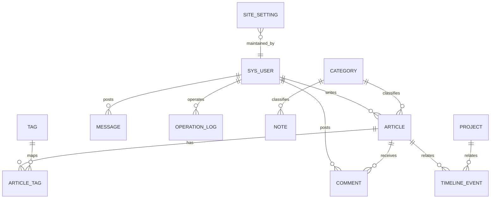
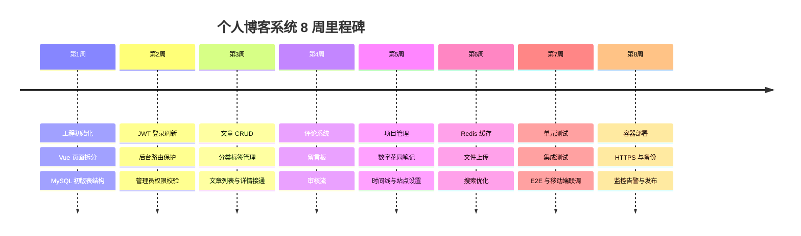

# 现有 Stitch 博客 UI 到可运营个人博客系统的分析与项目规划报告

## Executive Summary

现有前端 UI 已经具备非常完整的“壳层”：公开端包含首页、文章列表、文章详情、数字花园笔记、时间线、项目实验室、关于页、留言板，以及独立的后台控制台；其设计系统也已经明确为“living terminal + digital garden + Glassmorphism”，并且特别强调深色主题、中文可读性、JetBrains Mono/Inter/Space Grotesk 字体组合与移动端单列适配。fileciteturn0file6 fileciteturn0file3 fileciteturn0file2 fileciteturn0file4 fileciteturn0file5 fileciteturn0file9 fileciteturn0file0 fileciteturn0file8 fileciteturn0file1 fileciteturn0file7 这意味着项目的正确方向不是“重做 UI”，而是把静态 mock 页面升级为一个可持续录入、审核、发布、检索、统计和维护内容的中小型个人博客系统。基于题设的技术约束与规模假设，建议采用模块化单体：Spring Boot 3.5.x + Spring Security + MyBatis-Plus + MySQL 8.4 + Redis + JWT，前台优先打通“访客 + 管理员”完整闭环，注册用户体系在第二迭代启用但从第一天预留数据模型与鉴权边界。搜索建议分三层推进：MVP 先用 MySQL 条件查询和分页，阶段二可加 FULLTEXT，若后续需要拼写容错、筛选分面和更好的搜索体验，再升级到 Meilisearch；只有在数据量、复杂检索和分析需求明显上升时，再考虑 Elasticsearch。官方文档已经分别提供了 Spring Security 鉴权/授权、Spring MVC 校验与异常处理、Redis TTL 缓存、MyBatis-Plus 分页与逻辑删除、MySQL InnoDB 索引与 FULLTEXT、Spring Boot 容器化/监控的成熟实践，这套组合完全足以支撑当前项目目标。citeturn8search1turn3search13turn3search6turn0search8turn6search0turn6search5turn5search2turn5search16turn5search0turn3search7turn1search2

## 关键验收标准

| 验收项 | 通过标准 |
|---|---|
| 后台录入闭环 | 管理员能够在后台新增、编辑、发布文章/项目/笔记/时间线，发布后公开端对应页面立即可见，且列表、详情、计数、筛选均正确更新 |
| 权限边界清晰 | `/api/admin/**` 全部需要有效 JWT 且具备 `ADMIN` 权限；公开浏览类接口无需登录；评论/留言/点赞按设计要求可公开或限流开放 |
| 公开端可用 | 文章列表分页、关键词搜索、分类/标签筛选、文章详情、点赞、评论、留言板、项目页、笔记页、时间线页均能与现有 UI 一一对接 |
| 数据一致性 | 核心表具备唯一约束、必要索引、逻辑删除和审计字段；文章、评论、留言计数与展示结果一致；异常情况下不会出现“发了但看不到”或“删了还显示” |
| 可部署与可维护 | 项目可通过容器在单机环境部署，具备 HTTPS、数据库备份、基础监控、日志审计和最少一条 CI/CD 流水线；核心 API、集成测试、E2E 各有覆盖 |

## 现状与需求分析

当前 Stitch 产物已经把信息架构做到了一个很好的起点：首页提供 Hero、自我介绍、Knowledge Galaxy 与 Currently Learning；文章列表页具备搜索、分类/技术筛选和排序；文章详情页具备 Markdown 阅读区、评论区与语言切换；留言板已有昵称/邮箱/内容表单；后台已具备侧边栏、控制台统计和文章管理表格。公开端主导航目前是 Home、Articles、Projects、Notes、Timeline、About，而 Message Board 与 Admin 已经有独立页面，但尚未整合为稳定路由入口。fileciteturn0file6 fileciteturn0file3 fileciteturn0file2 fileciteturn0file8 fileciteturn0file1 设计系统还明确强调“中文文本要保持至少 1.6 行高”“桌面固定栅格、移动端单列”，这意味着后续前后端对接时不应破坏既有视觉/阅读节奏。fileciteturn0file7

由于现有 UI 已经暴露了评论区和留言表单，后端必须把这两类接口视为高风险输入面：在 Spring MVC 层做 Bean Validation，在业务层做敏感词/长度检查、审核状态控制和频率限制，在渲染链路里做 Markdown/HTML 清洗与 XSS 防护。Spring MVC 原生支持 `@RequestMapping` 方法校验与全局异常处理；entity["organization","OWASP","app security project"] 的输入校验和 XSS 备忘单也明确把输入约束、输出编码/清洗视作基础防线。fileciteturn0file2 fileciteturn0file8 citeturn3search6turn0search8turn13search3turn13search1turn13search16

| 功能域 | 访客 | 注册用户 | 管理员 | 权限标注 |
|---|---|---|---|---|
| 浏览首页 / 关于页 / 项目 / 笔记 / 时间线 | 可用 | 可用 | 可用 | 公开 |
| 浏览文章列表 / 详情 / 相关文章 | 可用 | 可用 | 可用 | 公开 |
| 搜索、筛选、分页、排序 | 可用 | 可用 | 可用 | 公开 |
| 点赞文章 | 可用；按 `clientId` 或登录态去重 | 可用；可绑定到账户 | 可用 | 公开 |
| 发布评论 | 可用；建议默认待审核 | 可用；建议优先通过登录昵称/头像 | 可用 | 公开或需登录，取决于站点策略 |
| 浏览留言板 | 可用 | 可用 | 可用 | 公开 |
| 发布留言 | 可用；建议验证码 + 待审核 | 可用；可关联用户 | 可用 | 公开或需登录，取决于站点策略 |
| 注册 / 登录 / 刷新令牌 / 退出 | 不适用 | 可用 | 可用 | 需登录 |
| 查看和编辑个人资料 | 不适用 | 可用 | 可用 | 需登录 |
| 后台仪表盘 | 不可用 | 不可用 | 可用 | 管理员 |
| 发布 / 编辑 / 置顶 / 隐藏文章 | 不可用 | 不可用 | 可用 | 管理员 |
| 管理分类 / 标签 / 项目 / 笔记 / 时间线 | 不可用 | 不可用 | 可用 | 管理员 |
| 审核 / 删除评论与留言 | 不可用 | 不可用 | 可用 | 管理员 |
| 用户管理 | 不可用 | 不可用 | 可用 | 管理员 |
| 系统设置 / 首页 Hero / About 内容配置 | 不可用 | 不可用 | 可用 | 管理员 |
| 上传图片 / 封面 / 附件 | 不可用 | 可选 | 可用 | 管理员优先，注册用户后续扩展 |

从产品节奏上看，**角色模型应设计为“访客、注册用户、管理员三层”，但首期交付优先打通“访客 + 管理员”**。原因很简单：当前 UI 已经完整覆盖了公开浏览与后台管理，却没有正式的注册/用户中心页面，因此注册用户能力更适合作为第二迭代接入；不过数据库、接口和 JWT 角色字段应该一开始就预留，避免后面返工。fileciteturn0file6 fileciteturn0file3 fileciteturn0file1

## 功能优先级与数据设计

功能优先级应以“先让现有页面有真实数据，再补充高级能力”为原则。当前 UI 里最成熟、最接近真实系统的页面是首页、文章列表、文章详情、留言板和后台文章管理，因此它们对应的数据读写链路都应进入 MVP。MyBatis-Plus 官方文档已经给出通用 CRUD、分页、逻辑删除与条件构造器能力，这非常适合把这类中后台数据模块快速搭起来。fileciteturn0file6 fileciteturn0file3 fileciteturn0file2 fileciteturn0file8 fileciteturn0file1 citeturn6search1turn6search0turn6search5

| 功能 | 描述 | 依赖 | 优先级 | 验收标准 |
|---|---|---|---|---|
| 站点设置 | 维护首页 Hero、当前学习、社交链接、About 内容 | `site_setting`、后台鉴权 | MVP | 不改代码即可从后台更新首页与 About 关键文案 |
| 首页概览 | 返回最新文章、精选项目、学习状态、标签/分类统计 | article/project/note/site_setting/cache | MVP | 首页所有核心区域均由接口返回，不再依赖硬编码 |
| 文章列表 | 分页、关键词搜索、分类/标签筛选、排序 | article/category/tag/article_tag | MVP | UI 中筛选、排序、分页全部生效 |
| 文章详情 | 按 slug 查询详情、增加浏览量、返回 TOC/元信息 | article/comment/cache | MVP | 详情页内容、标签、计数、评论区可正常展示 |
| 点赞 | 文章点赞、去重、防刷 | Redis、article | MVP | 重复点赞不重复计数，接口有幂等策略 |
| 评论系统 | 评论提交、审核、列表、回复 | comment、article、审核流 | MVP | 评论可提交、可审核、前台仅显示通过项 |
| 留言板 | 留言提交、列表、排序、管理员回复 | message、审核流 | MVP | 留言表单可提交通，列表与回复渲染正常 |
| 后台鉴权 | 管理员登录、Access/Refresh Token、权限校验 | sys_user、JWT、Redis | MVP | 后台无 token 无法访问，过期 token 可刷新 |
| 文章后台 CRUD | 新增、编辑、发布、隐藏、置顶、删除 | article、category/tag、上传 | MVP | 从后台发一篇新文章，前台可见 |
| 分类与标签管理 | 分类/标签 CRUD、排序、启停 | category/tag | MVP | 可在后台新增/禁用后立即影响前台筛选 |
| 项目管理 | 项目列表与详情内容维护 | project | MVP | Project Lab 完全可由后台录入 |
| 笔记管理 | Digital Garden Notes 与 TIL 维护 | note/category | MVP | 笔记卡片和 TIL 区域可后台维护 |
| 时间线管理 | 成长时间线录入、排序、关联项目/文章 | timeline_event | MVP | 时间线页可展示后台录入的节点 |
| 文件上传 | 封面图、插图、头像上传 | 存储服务 | 次要 | 支持后台上传并返回 URL |
| 注册用户体系 | 注册、登录、我的资料、我的评论 | sys_user、JWT、前端用户页 | 次要 | 数据与接口可用；前台用户中心可阶段二补齐 |
| 搜索增强 | MySQL FULLTEXT 或 Meilisearch | 搜索索引同步 | 次要 | 搜索结果相关性优于简单 LIKE |
| RSS / 导入导出 / 社交登录 | 面向长期运营的增强能力 | 额外模块 | 可选 | 不影响 MVP 主干交付 |
| 多人协作 | `AUTHOR/EDITOR/ADMIN` 多角色创作流 | 更完整 RBAC | 可选 | 当前个人博客不作为首期目标 |

补一条很重要的前后端契约：**如果数据库主键使用 BIGINT，API 返回给 Vue 前端时建议统一序列化为字符串**。原因是 JavaScript `Number` 的最大安全整数只有 `2^53 - 1`，而 `BigInt` 又不能被 `JSON.stringify()` 原生直接序列化；如果不提前统一，后续列表、详情、编辑页会出现 ID 精度与序列化兼容问题。citeturn12search0turn12search5

## 数据库建模与 SQL 草案

数据库层建议统一使用 InnoDB、`utf8mb4`、短整型主键和明确索引策略。MySQL 官方文档明确建议为每个 InnoDB 表定义主键；InnoDB 使用主键作为聚簇索引，二级索引项会附带主键列，因此主键宜短；同时 MySQL 也明确建议优先使用 `utf8mb4` 以获得更好的兼容性。MySQL 还支持在 InnoDB 上对 `CHAR/VARCHAR/TEXT` 建 FULLTEXT 索引，这使得文章搜索可以从 `LIKE` 逐步升级到数据库内置全文检索。citeturn5search2turn5search15turn5search16turn5search5turn5search0



| 表名 | 关键字段 | 索引建议 | 关系与说明 |
|---|---|---|---|
| `sys_user` | `id BIGINT`、`username`、`email`、`password_hash`、`nickname`、`avatar_url`、`role_code`、`status`、`last_login_at`、`created_at`、`updated_at`、`deleted` | `uk_username`、`uk_email`、`idx_role_status` | 账户主表；`role_code` 初期支持 `USER/ADMIN` |
| `site_setting` | `id`、`config_key`、`config_name`、`config_type`、`config_value`、`updated_by`、`updated_at` | `uk_config_key` | 首页 Hero、About、社交链接、SEO 等站点配置 |
| `category` | `id`、`biz_type`、`name`、`slug`、`description`、`sort_order`、`status`、`created_at`、`updated_at`、`deleted` | `uk_biz_type_slug`、`idx_biz_sort_status` | 文章/笔记分类；`biz_type` 如 `ARTICLE/NOTE` |
| `tag` | `id`、`name`、`slug`、`color`、`description`、`status`、`created_at`、`updated_at`、`deleted` | `uk_tag_slug`、`uk_tag_name` | 文章标签 |
| `article` | `id`、`author_user_id`、`category_id`、`title`、`slug`、`summary`、`cover_image_url`、`content_md`、`content_html`、`status`、`is_top`、`allow_comment`、`view_count`、`like_count`、`comment_count`、`published_at`、`created_at`、`updated_at`、`deleted` | `uk_article_slug`、`idx_status_published`、`idx_category_status_published`、`idx_author_created`、`ft_article_search` | 博客文章主表；公开路由建议按 `slug` 访问 |
| `article_tag` | `article_id`、`tag_id`、`created_at` | 复合主键 `(article_id, tag_id)`、`idx_tag_article` | 文章与标签 N:M |
| `project` | `id`、`name`、`slug`、`description`、`cover_image_url`、`tech_stack_json`、`repo_url`、`demo_url`、`status`、`learning_summary`、`is_featured`、`sort_order`、`created_at`、`updated_at`、`deleted` | `uk_project_slug`、`idx_status_featured_sort` | Project Lab 主表 |
| `note` | `id`、`author_user_id`、`category_id`、`title`、`slug`、`summary`、`content_md`、`note_type`、`status`、`is_pinned`、`sort_order`、`created_at`、`updated_at`、`deleted` | `uk_note_slug`、`idx_note_category_status`、`idx_note_type_status` | 数字花园笔记；`note_type` 可区分普通笔记与 TIL |
| `timeline_event` | `id`、`title`、`event_date`、`event_type`、`summary`、`content_md`、`related_article_id`、`related_project_id`、`status`、`sort_order`、`created_at`、`updated_at`、`deleted` | `idx_event_date_status`、`idx_related_article`、`idx_related_project` | 成长时间线事件 |
| `comment` | `id`、`article_id`、`parent_id`、`user_id`、`nickname`、`email`、`content`、`status`、`ip_hash`、`user_agent`、`created_at`、`updated_at`、`deleted` | `idx_article_status_created`、`idx_parent_created`、`idx_user_created` | 评论主表；支持游客或已登录用户 |
| `message` | `id`、`user_id`、`nickname`、`email`、`content`、`reply_content`、`reply_user_id`、`status`、`ip_hash`、`user_agent`、`created_at`、`updated_at`、`deleted` | `idx_status_created`、`idx_reply_user` | 留言板主表 |
| `operation_log` | `id`、`operator_user_id`、`module`、`action`、`biz_id`、`request_method`、`request_uri`、`request_id`、`ip`、`user_agent`、`request_json`、`response_json`、`success`、`created_at` | `idx_operator_time`、`idx_module_time`、`idx_request_id` | 审计日志，记录后台关键操作 |

以下 SQL 为 MySQL 8.4 草案；为降低迁移复杂度，默认不加物理外键，采用“索引 + 服务层约束 + 逻辑删除”的组合。如果首期不启用 FULLTEXT，可暂时移除 `ft_article_search` 索引。逻辑删除可直接用 MyBatis-Plus 的 `@TableLogic` 支撑。citeturn6search5turn5search0turn5search15

```sql
CREATE TABLE sys_user (
  id BIGINT UNSIGNED NOT NULL AUTO_INCREMENT,
  username VARCHAR(64) NOT NULL,
  email VARCHAR(128) DEFAULT NULL,
  password_hash VARCHAR(255) NOT NULL,
  nickname VARCHAR(64) NOT NULL,
  avatar_url VARCHAR(255) DEFAULT NULL,
  bio VARCHAR(255) DEFAULT NULL,
  role_code VARCHAR(32) NOT NULL DEFAULT 'USER',
  status TINYINT UNSIGNED NOT NULL DEFAULT 1 COMMENT '0-disabled,1-enabled',
  last_login_at DATETIME DEFAULT NULL,
  created_at DATETIME NOT NULL DEFAULT CURRENT_TIMESTAMP,
  updated_at DATETIME NOT NULL DEFAULT CURRENT_TIMESTAMP ON UPDATE CURRENT_TIMESTAMP,
  deleted TINYINT(1) NOT NULL DEFAULT 0,
  PRIMARY KEY (id),
  UNIQUE KEY uk_user_username (username),
  UNIQUE KEY uk_user_email (email),
  KEY idx_user_role_status (role_code, status),
  KEY idx_user_created_at (created_at)
) ENGINE=InnoDB DEFAULT CHARSET=utf8mb4 COLLATE=utf8mb4_0900_ai_ci;

CREATE TABLE site_setting (
  id BIGINT UNSIGNED NOT NULL AUTO_INCREMENT,
  config_key VARCHAR(64) NOT NULL,
  config_name VARCHAR(100) NOT NULL,
  config_type VARCHAR(32) NOT NULL DEFAULT 'TEXT' COMMENT 'TEXT,MARKDOWN,JSON,BOOLEAN',
  config_value LONGTEXT NOT NULL,
  updated_by BIGINT UNSIGNED DEFAULT NULL,
  updated_at DATETIME NOT NULL DEFAULT CURRENT_TIMESTAMP ON UPDATE CURRENT_TIMESTAMP,
  PRIMARY KEY (id),
  UNIQUE KEY uk_config_key (config_key)
) ENGINE=InnoDB DEFAULT CHARSET=utf8mb4 COLLATE=utf8mb4_0900_ai_ci;

CREATE TABLE category (
  id BIGINT UNSIGNED NOT NULL AUTO_INCREMENT,
  biz_type VARCHAR(32) NOT NULL DEFAULT 'ARTICLE',
  name VARCHAR(64) NOT NULL,
  slug VARCHAR(64) NOT NULL,
  description VARCHAR(255) DEFAULT NULL,
  sort_order INT NOT NULL DEFAULT 0,
  status TINYINT UNSIGNED NOT NULL DEFAULT 1 COMMENT '0-hidden,1-active',
  created_at DATETIME NOT NULL DEFAULT CURRENT_TIMESTAMP,
  updated_at DATETIME NOT NULL DEFAULT CURRENT_TIMESTAMP ON UPDATE CURRENT_TIMESTAMP,
  deleted TINYINT(1) NOT NULL DEFAULT 0,
  PRIMARY KEY (id),
  UNIQUE KEY uk_biz_type_slug (biz_type, slug),
  UNIQUE KEY uk_biz_type_name (biz_type, name),
  KEY idx_biz_sort_status (biz_type, status, sort_order)
) ENGINE=InnoDB DEFAULT CHARSET=utf8mb4 COLLATE=utf8mb4_0900_ai_ci;

CREATE TABLE tag (
  id BIGINT UNSIGNED NOT NULL AUTO_INCREMENT,
  name VARCHAR(64) NOT NULL,
  slug VARCHAR(64) NOT NULL,
  color VARCHAR(32) DEFAULT NULL,
  description VARCHAR(255) DEFAULT NULL,
  status TINYINT UNSIGNED NOT NULL DEFAULT 1 COMMENT '0-hidden,1-active',
  created_at DATETIME NOT NULL DEFAULT CURRENT_TIMESTAMP,
  updated_at DATETIME NOT NULL DEFAULT CURRENT_TIMESTAMP ON UPDATE CURRENT_TIMESTAMP,
  deleted TINYINT(1) NOT NULL DEFAULT 0,
  PRIMARY KEY (id),
  UNIQUE KEY uk_tag_slug (slug),
  UNIQUE KEY uk_tag_name (name),
  KEY idx_tag_status_created (status, created_at)
) ENGINE=InnoDB DEFAULT CHARSET=utf8mb4 COLLATE=utf8mb4_0900_ai_ci;

CREATE TABLE article (
  id BIGINT UNSIGNED NOT NULL AUTO_INCREMENT,
  author_user_id BIGINT UNSIGNED NOT NULL,
  category_id BIGINT UNSIGNED DEFAULT NULL,
  title VARCHAR(200) NOT NULL,
  slug VARCHAR(200) NOT NULL,
  summary VARCHAR(500) DEFAULT NULL,
  cover_image_url VARCHAR(255) DEFAULT NULL,
  content_md LONGTEXT NOT NULL,
  content_html LONGTEXT DEFAULT NULL,
  status TINYINT UNSIGNED NOT NULL DEFAULT 0 COMMENT '0-draft,1-published,2-hidden',
  is_top TINYINT(1) NOT NULL DEFAULT 0,
  allow_comment TINYINT(1) NOT NULL DEFAULT 1,
  view_count BIGINT UNSIGNED NOT NULL DEFAULT 0,
  like_count BIGINT UNSIGNED NOT NULL DEFAULT 0,
  comment_count BIGINT UNSIGNED NOT NULL DEFAULT 0,
  published_at DATETIME DEFAULT NULL,
  created_at DATETIME NOT NULL DEFAULT CURRENT_TIMESTAMP,
  updated_at DATETIME NOT NULL DEFAULT CURRENT_TIMESTAMP ON UPDATE CURRENT_TIMESTAMP,
  deleted TINYINT(1) NOT NULL DEFAULT 0,
  PRIMARY KEY (id),
  UNIQUE KEY uk_article_slug (slug),
  KEY idx_status_published (status, published_at),
  KEY idx_category_status_published (category_id, status, published_at),
  KEY idx_author_created (author_user_id, created_at),
  FULLTEXT KEY ft_article_search (title, summary, content_md)
) ENGINE=InnoDB DEFAULT CHARSET=utf8mb4 COLLATE=utf8mb4_0900_ai_ci;

CREATE TABLE article_tag (
  article_id BIGINT UNSIGNED NOT NULL,
  tag_id BIGINT UNSIGNED NOT NULL,
  created_at DATETIME NOT NULL DEFAULT CURRENT_TIMESTAMP,
  PRIMARY KEY (article_id, tag_id),
  KEY idx_tag_article (tag_id, article_id)
) ENGINE=InnoDB DEFAULT CHARSET=utf8mb4 COLLATE=utf8mb4_0900_ai_ci;

CREATE TABLE project (
  id BIGINT UNSIGNED NOT NULL AUTO_INCREMENT,
  name VARCHAR(150) NOT NULL,
  slug VARCHAR(150) NOT NULL,
  description VARCHAR(500) NOT NULL,
  cover_image_url VARCHAR(255) DEFAULT NULL,
  tech_stack_json JSON DEFAULT NULL,
  repo_url VARCHAR(255) DEFAULT NULL,
  demo_url VARCHAR(255) DEFAULT NULL,
  status TINYINT UNSIGNED NOT NULL DEFAULT 0 COMMENT '0-planning,1-developing,2-completed,3-archived',
  learning_summary TEXT DEFAULT NULL,
  is_featured TINYINT(1) NOT NULL DEFAULT 0,
  sort_order INT NOT NULL DEFAULT 0,
  created_at DATETIME NOT NULL DEFAULT CURRENT_TIMESTAMP,
  updated_at DATETIME NOT NULL DEFAULT CURRENT_TIMESTAMP ON UPDATE CURRENT_TIMESTAMP,
  deleted TINYINT(1) NOT NULL DEFAULT 0,
  PRIMARY KEY (id),
  UNIQUE KEY uk_project_slug (slug),
  KEY idx_status_featured_sort (status, is_featured, sort_order, created_at)
) ENGINE=InnoDB DEFAULT CHARSET=utf8mb4 COLLATE=utf8mb4_0900_ai_ci;

CREATE TABLE note (
  id BIGINT UNSIGNED NOT NULL AUTO_INCREMENT,
  author_user_id BIGINT UNSIGNED NOT NULL,
  category_id BIGINT UNSIGNED DEFAULT NULL,
  title VARCHAR(150) NOT NULL,
  slug VARCHAR(150) NOT NULL,
  summary VARCHAR(300) DEFAULT NULL,
  content_md LONGTEXT NOT NULL,
  note_type VARCHAR(32) NOT NULL DEFAULT 'NOTE' COMMENT 'NOTE,TIL',
  status TINYINT UNSIGNED NOT NULL DEFAULT 1 COMMENT '0-hidden,1-published',
  is_pinned TINYINT(1) NOT NULL DEFAULT 0,
  sort_order INT NOT NULL DEFAULT 0,
  created_at DATETIME NOT NULL DEFAULT CURRENT_TIMESTAMP,
  updated_at DATETIME NOT NULL DEFAULT CURRENT_TIMESTAMP ON UPDATE CURRENT_TIMESTAMP,
  deleted TINYINT(1) NOT NULL DEFAULT 0,
  PRIMARY KEY (id),
  UNIQUE KEY uk_note_slug (slug),
  KEY idx_note_category_status (category_id, status, updated_at),
  KEY idx_note_type_status (note_type, status, updated_at)
) ENGINE=InnoDB DEFAULT CHARSET=utf8mb4 COLLATE=utf8mb4_0900_ai_ci;

CREATE TABLE timeline_event (
  id BIGINT UNSIGNED NOT NULL AUTO_INCREMENT,
  title VARCHAR(150) NOT NULL,
  event_date DATE NOT NULL,
  event_type VARCHAR(32) NOT NULL DEFAULT 'LEARNING' COMMENT 'LEARNING,PROJECT,INTERNSHIP,COURSE,OTHER',
  summary VARCHAR(300) DEFAULT NULL,
  content_md TEXT DEFAULT NULL,
  related_article_id BIGINT UNSIGNED DEFAULT NULL,
  related_project_id BIGINT UNSIGNED DEFAULT NULL,
  status TINYINT UNSIGNED NOT NULL DEFAULT 1 COMMENT '0-hidden,1-published',
  sort_order INT NOT NULL DEFAULT 0,
  created_at DATETIME NOT NULL DEFAULT CURRENT_TIMESTAMP,
  updated_at DATETIME NOT NULL DEFAULT CURRENT_TIMESTAMP ON UPDATE CURRENT_TIMESTAMP,
  deleted TINYINT(1) NOT NULL DEFAULT 0,
  PRIMARY KEY (id),
  KEY idx_event_date_status (event_date, status, sort_order),
  KEY idx_related_article (related_article_id),
  KEY idx_related_project (related_project_id)
) ENGINE=InnoDB DEFAULT CHARSET=utf8mb4 COLLATE=utf8mb4_0900_ai_ci;

CREATE TABLE comment (
  id BIGINT UNSIGNED NOT NULL AUTO_INCREMENT,
  article_id BIGINT UNSIGNED NOT NULL,
  parent_id BIGINT UNSIGNED DEFAULT NULL,
  user_id BIGINT UNSIGNED DEFAULT NULL,
  nickname VARCHAR(64) NOT NULL,
  email VARCHAR(128) DEFAULT NULL,
  content TEXT NOT NULL,
  status TINYINT UNSIGNED NOT NULL DEFAULT 0 COMMENT '0-pending,1-approved,2-rejected',
  ip_hash CHAR(64) DEFAULT NULL,
  user_agent VARCHAR(255) DEFAULT NULL,
  created_at DATETIME NOT NULL DEFAULT CURRENT_TIMESTAMP,
  updated_at DATETIME NOT NULL DEFAULT CURRENT_TIMESTAMP ON UPDATE CURRENT_TIMESTAMP,
  deleted TINYINT(1) NOT NULL DEFAULT 0,
  PRIMARY KEY (id),
  KEY idx_article_status_created (article_id, status, created_at),
  KEY idx_parent_created (parent_id, created_at),
  KEY idx_user_created (user_id, created_at)
) ENGINE=InnoDB DEFAULT CHARSET=utf8mb4 COLLATE=utf8mb4_0900_ai_ci;

CREATE TABLE message (
  id BIGINT UNSIGNED NOT NULL AUTO_INCREMENT,
  user_id BIGINT UNSIGNED DEFAULT NULL,
  nickname VARCHAR(64) NOT NULL,
  email VARCHAR(128) DEFAULT NULL,
  content TEXT NOT NULL,
  reply_content TEXT DEFAULT NULL,
  reply_user_id BIGINT UNSIGNED DEFAULT NULL,
  status TINYINT UNSIGNED NOT NULL DEFAULT 0 COMMENT '0-pending,1-approved,2-rejected',
  ip_hash CHAR(64) DEFAULT NULL,
  user_agent VARCHAR(255) DEFAULT NULL,
  created_at DATETIME NOT NULL DEFAULT CURRENT_TIMESTAMP,
  updated_at DATETIME NOT NULL DEFAULT CURRENT_TIMESTAMP ON UPDATE CURRENT_TIMESTAMP,
  deleted TINYINT(1) NOT NULL DEFAULT 0,
  PRIMARY KEY (id),
  KEY idx_status_created (status, created_at),
  KEY idx_reply_user (reply_user_id, created_at)
) ENGINE=InnoDB DEFAULT CHARSET=utf8mb4 COLLATE=utf8mb4_0900_ai_ci;

CREATE TABLE operation_log (
  id BIGINT UNSIGNED NOT NULL AUTO_INCREMENT,
  operator_user_id BIGINT UNSIGNED DEFAULT NULL,
  module VARCHAR(64) NOT NULL,
  action VARCHAR(64) NOT NULL,
  biz_id VARCHAR(64) DEFAULT NULL,
  request_method VARCHAR(16) NOT NULL,
  request_uri VARCHAR(255) NOT NULL,
  request_id VARCHAR(64) DEFAULT NULL,
  ip VARCHAR(64) DEFAULT NULL,
  user_agent VARCHAR(255) DEFAULT NULL,
  request_json JSON DEFAULT NULL,
  response_json JSON DEFAULT NULL,
  success TINYINT(1) NOT NULL DEFAULT 1,
  created_at DATETIME NOT NULL DEFAULT CURRENT_TIMESTAMP,
  PRIMARY KEY (id),
  KEY idx_operator_time (operator_user_id, created_at),
  KEY idx_module_time (module, created_at),
  KEY idx_request_id (request_id)
) ENGINE=InnoDB DEFAULT CHARSET=utf8mb4 COLLATE=utf8mb4_0900_ai_ci;
```

## API 与认证授权

API 契约建议统一成 `Result<T>` 与 `PageResult<T>` 两层包裹。这样做最符合当前前端 UI 的接线需求：列表页、详情页、后台表格、表单回填和 toast 提示都能用同一套解析逻辑。与此同时，Spring MVC 已经提供 `@ControllerAdvice`、`ResponseEntityExceptionHandler` 与方法校验能力，因此完全可以在内部复用 Spring 的异常/校验机制，再由全局异常处理器转译为统一响应结构。JWT 本身的语义来自 entity["organization","IETF","internet standards body"] 的 RFC 7519，而 RFC 8725 又把 JWT 的安全实现要求进一步收紧；Spring Security 则默认从 `Authorization: Bearer <token>` 读取令牌，并能在请求与方法层做授权；密码存储应遵循 Argon2 或同类自适应哈希，Spring Security 的 `DelegatingPasswordEncoder` 与 `Argon2PasswordEncoder` 可以直接支撑这一点。citeturn2search0turn1search1turn2search13turn2search2turn3search16turn3search1turn0search8turn3search6turn4search1turn4search2turn2search3

```json
{
  "Result<T>": {
    "code": 0,
    "message": "OK",
    "data": {},
    "traceId": "20260428-6f8d0bcb"
  },
  "PageResult<T>": {
    "list": [],
    "pageNum": 1,
    "pageSize": 10,
    "total": 0,
    "totalPages": 0,
    "hasNext": false,
    "hasPrevious": false
  }
}
```

| 方法 | 路径 | 说明 | 关键参数 | 鉴权 |
|---|---|---|---|---|
| GET | `/api/home/overview` | 首页概览数据 | 可选 `locale` | 公开 |
| GET | `/api/about/profile` | About 页数据 | 无 | 公开 |
| GET | `/api/articles` | 文章分页列表 | `keyword, categorySlug, tagSlug, pageNum, pageSize, sort` | 公开 |
| GET | `/api/articles/{slug}` | 文章详情 | `slug` | 公开 |
| POST | `/api/articles/{id}/like` | 点赞文章 | `clientId` | 公开 |
| GET | `/api/articles/{id}/comments` | 评论列表 | `pageNum,pageSize` | 公开 |
| POST | `/api/comments` | 发表评论 | `articleId, content, nickname/email 或登录态` | 公开或需登录 |
| GET | `/api/categories` | 分类列表 | `bizType` | 公开 |
| GET | `/api/tags` | 标签列表 | 无 | 公开 |
| GET | `/api/projects` | 项目列表 | `status, featured` | 公开 |
| GET | `/api/notes` | 笔记列表 | `categorySlug, noteType, pageNum, pageSize` | 公开 |
| GET | `/api/timeline/events` | 时间线事件列表 | `year,eventType` | 公开 |
| GET | `/api/messages` | 留言列表 | `sort,pageNum,pageSize` | 公开 |
| POST | `/api/messages` | 提交留言 | `nickname,email,content` | 公开或需登录 |
| POST | `/api/auth/register` | 注册 | `username,email,password,nickname` | 公开 |
| POST | `/api/auth/login` | 登录 | `account,password` | 公开 |
| POST | `/api/auth/refresh` | 刷新令牌 | `refreshToken` 或 cookie | 公开 |
| POST | `/api/auth/logout` | 退出登录 | 无 | 需登录 |
| GET | `/api/users/me` | 当前用户信息 | 无 | 需登录 |

| 方法 | 路径 | 说明 | 关键参数 | 鉴权 |
|---|---|---|---|---|
| GET | `/api/admin/dashboard` | 后台统计与活动流 | 无 | ADMIN |
| GET | `/api/admin/articles` | 后台文章列表 | `keyword,status,pageNum,pageSize` | ADMIN |
| POST | `/api/admin/articles` | 新增文章 | ArticleSaveDTO | ADMIN |
| PUT | `/api/admin/articles/{id}` | 修改文章 | ArticleSaveDTO | ADMIN |
| PUT | `/api/admin/articles/{id}/status` | 修改文章状态 | `status` | ADMIN |
| DELETE | `/api/admin/articles/{id}` | 删除文章 | `id` | ADMIN |
| CRUD | `/api/admin/categories` | 分类管理 | CategoryDTO | ADMIN |
| CRUD | `/api/admin/tags` | 标签管理 | TagDTO | ADMIN |
| CRUD | `/api/admin/projects` | 项目管理 | ProjectDTO | ADMIN |
| CRUD | `/api/admin/notes` | 笔记管理 | NoteDTO | ADMIN |
| CRUD | `/api/admin/timeline-events` | 时间线管理 | TimelineEventDTO | ADMIN |
| GET | `/api/admin/comments` | 评论审核列表 | `status,pageNum,pageSize` | ADMIN |
| PUT | `/api/admin/comments/{id}/status` | 评论审核 | `status` | ADMIN |
| GET | `/api/admin/messages` | 留言审核列表 | `status,pageNum,pageSize` | ADMIN |
| PUT | `/api/admin/messages/{id}/status` | 留言审核 | `status,replyContent` | ADMIN |
| GET | `/api/admin/users` | 用户列表 | `keyword,role,status` | ADMIN |
| PUT | `/api/admin/users/{id}` | 用户状态/角色调整 | UserAdminUpdateDTO | ADMIN |
| GET | `/api/admin/site-settings` | 站点设置列表 | 无 | ADMIN |
| PUT | `/api/admin/site-settings/{key}` | 更新站点设置 | `configValue` | ADMIN |
| POST | `/api/admin/files/upload` | 上传封面/图片 | multipart/form-data | ADMIN |

在认证细节上，建议采用如下默认值：Access Token 15–30 分钟，Refresh Token 7–30 天；JWT 至少包含 `sub`、`role`、`tokenType`、`jti`、`iat`、`exp`；验证时显式固定允许算法，不做“按 token 自报算法”式解析；登录、刷新与退出都在 Redis 中维护 refresh/session 状态与 TTL；管理员路由同时做路径鉴权和方法级 `@PreAuthorize` 双保险。Redis 原生命令支持 TTL 与原子计数，因此它也适合承载 refresh token、频率限制和计数缓冲。citeturn1search1turn2search0turn2search13turn3search1turn2search2turn1search2turn1search6turn14search0turn14search1

以下给出 10 个核心 API 的完整请求/响应示例，示例中 ID 均按字符串返回。

**获取首页概览**

请求：`GET /api/home/overview`

```json
{
  "query": {}
}
```

响应：

```json
{
  "code": 0,
  "message": "OK",
  "data": {
    "hero": {
      "title": "你好，我是宇",
      "subtitle": "计算机科学与技术本科生，正在探索 Java 后端、Linux、数据库与 AI 应用开发",
      "terminalLines": [
        "whoami => yu",
        "focus => spring-boot, mysql, redis, linux, vue3"
      ]
    },
    "currentlyLearning": [
      "Spring Boot 3",
      "MySQL 8",
      "Redis",
      "Linux 运维基础",
      "AI Assistant Development"
    ],
    "latestArticles": [
      {
        "id": "1001",
        "title": "构建现代化的高性能数字花园",
        "slug": "building-modern-digital-garden",
        "publishedAt": "2026-04-27T10:30:00+08:00"
      }
    ],
    "featuredProjects": [
      {
        "id": "2001",
        "name": "个人博客系统",
        "slug": "personal-blog-system",
        "status": "DEVELOPING"
      }
    ],
    "stats": {
      "articleCount": 28,
      "projectCount": 6,
      "noteCount": 93,
      "viewCount": 124592
    }
  },
  "traceId": "20260428-01"
}
```

**获取文章列表**

请求：`GET /api/articles?keyword=spring&categorySlug=backend&tagSlug=jwt&pageNum=1&pageSize=10&sort=latest`

```json
{
  "query": {
    "keyword": "spring",
    "categorySlug": "backend",
    "tagSlug": "jwt",
    "pageNum": 1,
    "pageSize": 10,
    "sort": "latest"
  }
}
```

响应：

```json
{
  "code": 0,
  "message": "OK",
  "data": {
    "list": [
      {
        "id": "1001",
        "title": "Spring Security + JWT 后台鉴权设计",
        "slug": "spring-security-jwt-admin-auth",
        "summary": "面向个人博客后台的一套轻量鉴权实现。",
        "coverImageUrl": "https://cdn.example.com/article/1001-cover.webp",
        "category": {
          "id": "11",
          "name": "后端",
          "slug": "backend"
        },
        "tags": [
          {"id": "31", "name": "Spring Security", "slug": "spring-security"},
          {"id": "32", "name": "JWT", "slug": "jwt"}
        ],
        "viewCount": 2310,
        "likeCount": 109,
        "commentCount": 18,
        "publishedAt": "2026-04-27T10:30:00+08:00"
      }
    ],
    "pageNum": 1,
    "pageSize": 10,
    "total": 17,
    "totalPages": 2,
    "hasNext": true,
    "hasPrevious": false
  },
  "traceId": "20260428-02"
}
```

**获取文章详情**

请求：`GET /api/articles/building-modern-digital-garden`

```json
{
  "query": {}
}
```

响应：

```json
{
  "code": 0,
  "message": "OK",
  "data": {
    "id": "1001",
    "title": "构建现代化的高性能数字花园：从概念到终端实现",
    "slug": "building-modern-digital-garden",
    "summary": "从信息架构、视觉系统到性能优化的一次完整实现记录。",
    "contentMd": "# 标题\n\n这里是 Markdown 正文内容。",
    "contentHtml": "<h1>标题</h1><p>这里是渲染后的 HTML 内容。</p>",
    "coverImageUrl": "https://cdn.example.com/article/1001-cover.webp",
    "category": {
      "id": "11",
      "name": "架构",
      "slug": "architecture"
    },
    "tags": [
      {"id": "35", "name": "Glassmorphism", "slug": "glassmorphism"},
      {"id": "36", "name": "Performance", "slug": "performance"}
    ],
    "toc": [
      {"id": "sec-1", "text": "核心理念", "level": 2},
      {"id": "sec-2", "text": "性能优化策略", "level": 2}
    ],
    "author": {
      "id": "1",
      "nickname": "Yu",
      "avatarUrl": "https://cdn.example.com/avatar/yu.webp"
    },
    "viewCount": 1280,
    "likeCount": 128,
    "commentCount": 11,
    "publishedAt": "2026-04-27T10:30:00+08:00",
    "updatedAt": "2026-04-28T09:20:00+08:00"
  },
  "traceId": "20260428-03"
}
```

**点赞文章**

请求：`POST /api/articles/1001/like`

```json
{
  "clientId": "anon-9f6e3184fe",
  "source": "web"
}
```

响应：

```json
{
  "code": 0,
  "message": "OK",
  "data": {
    "articleId": "1001",
    "liked": true,
    "likeCount": 129
  },
  "traceId": "20260428-04"
}
```

**提交评论**

请求：`POST /api/comments`

```json
{
  "articleId": "1001",
  "parentId": null,
  "nickname": "Nova_Explorer",
  "email": "nova@example.com",
  "content": "这篇文章把 UI 风格和后端设计关联得很清楚。"
}
```

响应：

```json
{
  "code": 0,
  "message": "评论已提交，等待审核",
  "data": {
    "id": "5001",
    "articleId": "1001",
    "status": "PENDING",
    "createdAt": "2026-04-28T10:45:00+08:00"
  },
  "traceId": "20260428-05"
}
```

**提交留言**

请求：`POST /api/messages`

```json
{
  "nickname": "0xDev",
  "email": "dev@example.com",
  "content": "想看一篇关于 Redis 缓存策略的实战总结。"
}
```

响应：

```json
{
  "code": 0,
  "message": "留言已提交，等待审核",
  "data": {
    "id": "6001",
    "status": "PENDING",
    "createdAt": "2026-04-28T10:50:00+08:00"
  },
  "traceId": "20260428-06"
}
```

**用户登录**

请求：`POST /api/auth/login`

```json
{
  "account": "yu_admin",
  "password": "YourStrongPassword!"
}
```

响应：

```json
{
  "code": 0,
  "message": "OK",
  "data": {
    "user": {
      "id": "1",
      "username": "yu_admin",
      "nickname": "Yu",
      "roleCode": "ADMIN"
    },
    "accessToken": "eyJhbGciOiJIUzI1NiIsInR5cCI6IkpXVCJ9.access.token",
    "refreshToken": "eyJhbGciOiJIUzI1NiIsInR5cCI6IkpXVCJ9.refresh.token",
    "tokenType": "Bearer",
    "expiresIn": 1800
  },
  "traceId": "20260428-07"
}
```

**刷新令牌**

请求：`POST /api/auth/refresh`

```json
{
  "refreshToken": "eyJhbGciOiJIUzI1NiIsInR5cCI6IkpXVCJ9.refresh.token"
}
```

响应：

```json
{
  "code": 0,
  "message": "OK",
  "data": {
    "accessToken": "eyJhbGciOiJIUzI1NiIsInR5cCI6IkpXVCJ9.new.access.token",
    "refreshToken": "eyJhbGciOiJIUzI1NiIsInR5cCI6IkpXVCJ9.new.refresh.token",
    "tokenType": "Bearer",
    "expiresIn": 1800
  },
  "traceId": "20260428-08"
}
```

**获取后台仪表盘**

请求：`GET /api/admin/dashboard`

```json
{
  "headers": {
    "Authorization": "Bearer eyJhbGciOi..."
  }
}
```

响应：

```json
{
  "code": 0,
  "message": "OK",
  "data": {
    "articleCount": 28,
    "publishedArticleCount": 24,
    "commentPendingCount": 5,
    "messagePendingCount": 3,
    "viewCount": 124592,
    "likeCount": 2470,
    "recentActivities": [
      {
        "module": "ARTICLE",
        "action": "PUBLISH",
        "operator": "Yu",
        "createdAt": "2026-04-28T09:40:00+08:00"
      }
    ]
  },
  "traceId": "20260428-09"
}
```

**新增文章**

请求：`POST /api/admin/articles`

```json
{
  "title": "Spring Boot 个人博客后台模块化实践",
  "slug": "spring-boot-blog-modular-practice",
  "summary": "基于模块化单体拆分文章、评论、留言和站点配置。",
  "categoryId": "11",
  "tagIds": ["31", "32"],
  "coverImageUrl": "https://cdn.example.com/article/new-cover.webp",
  "contentMd": "# Spring Boot 个人博客后台模块化实践\n\n这里是正文。",
  "status": "PUBLISHED",
  "isTop": false,
  "allowComment": true,
  "publishedAt": "2026-04-28T11:00:00+08:00"
}
```

响应：

```json
{
  "code": 0,
  "message": "OK",
  "data": {
    "id": "1010",
    "slug": "spring-boot-blog-modular-practice",
    "status": "PUBLISHED"
  },
  "traceId": "20260428-10"
}
```

## 技术架构与前端对接

在技术架构上，建议明确选择**当前仍在维护的 Spring Boot 3.5.x 稳定线**，而不是从更早的 3.0/3.1 小版本起步；Spring Boot 官方文档当前同时列出了 4.0.x 与 3.5.x 稳定线，因此在“必须用 Boot 3”的前提下，选择 3.5.x 是最稳妥的。Redis 接入后，Spring Boot 会自动配置 `RedisCacheManager`；Spring Boot 还支持外置化配置、容器镜像构建、Actuator 端点、结构化日志与 Micrometer/Prometheus 指标，这些能力非常适合博客系统从“能跑”成长到“可维护”。另一方面，如果使用较新的 MyBatis-Plus，要注意分页插件 `PaginationInnerInterceptor` 自 3.5.9 起已拆分，需要额外引入 `mybatis-plus-jsqlparser`。citeturn8search1turn3search7turn8search3turn8search1turn8search20turn11search0turn11search1turn11search5turn6search0

```text
blog-system/
├─ backend/
│  ├─ src/main/java/com/yu/blog/
│  │  ├─ BlogApplication.java
│  │  ├─ common/
│  │  │  ├─ api/Result.java
│  │  │  ├─ api/PageResult.java
│  │  │  ├─ exception/BusinessException.java
│  │  │  ├─ exception/GlobalExceptionHandler.java
│  │  │  ├─ enums/
│  │  │  └─ util/
│  │  ├─ config/
│  │  │  ├─ MybatisPlusConfig.java
│  │  │  ├─ SecurityConfig.java
│  │  │  ├─ JacksonConfig.java
│  │  │  ├─ RedisConfig.java
│  │  │  └─ WebMvcConfig.java
│  │  ├─ auth/
│  │  │  ├─ JwtTokenService.java
│  │  │  ├─ JwtAuthenticationConverter.java
│  │  │  ├─ AuthController.java
│  │  │  ├─ AuthService.java
│  │  │  └─ dto/
│  │  ├─ module/
│  │  │  ├─ article/
│  │  │  │  ├─ controller/
│  │  │  │  ├─ service/
│  │  │  │  ├─ mapper/
│  │  │  │  ├─ entity/
│  │  │  │  ├─ dto/
│  │  │  │  └─ vo/
│  │  │  ├─ category/
│  │  │  ├─ tag/
│  │  │  ├─ project/
│  │  │  ├─ note/
│  │  │  ├─ timeline/
│  │  │  ├─ comment/
│  │  │  ├─ message/
│  │  │  ├─ site/
│  │  │  ├─ user/
│  │  │  └─ log/
│  │  └─ job/
│  │     ├─ ViewCountSyncJob.java
│  │     └─ CacheWarmupJob.java
│  ├─ src/main/resources/
│  │  ├─ application.yml
│  │  ├─ application-dev.yml
│  │  ├─ application-prod.yml
│  │  └─ mapper/
│  └─ Dockerfile
└─ frontend/
   ├─ src/
   │  ├─ api/
   │  ├─ components/
   │  ├─ views/
   │  ├─ stores/
   │  ├─ router/
   │  ├─ types/
   │  ├─ mocks/
   │  └─ utils/
   └─ package.json
```

以下伪代码展示一个推荐的分层写法。请求校验、角色鉴权、缓存失效与审计记录都应尽量放在“各司其职”的层里，而不是堆在 Controller。Spring Security 的认证信息会进入 `SecurityContextHolder`，因此服务层也能在必要时读取当前操作者。citeturn2search2turn3search16

```java
// controller
@RestController
@RequiredArgsConstructor
public class AdminArticleController {
    private final ArticleService articleService;

    @PostMapping("/api/admin/articles")
    @PreAuthorize("hasRole('ADMIN')")
    public Result<ArticleIdVO> create(@Valid @RequestBody ArticleSaveDTO dto) {
        return Result.ok(articleService.create(dto));
    }

    @PutMapping("/api/admin/articles/{id}")
    @PreAuthorize("hasRole('ADMIN')")
    public Result<Void> update(@PathVariable Long id, @Valid @RequestBody ArticleSaveDTO dto) {
        articleService.update(id, dto);
        return Result.ok();
    }
}
```

```java
// service
@Service
@RequiredArgsConstructor
public class ArticleServiceImpl implements ArticleService {
    private final ArticleMapper articleMapper;
    private final ArticleTagMapper articleTagMapper;
    private final CacheService cacheService;
    private final OperationLogService operationLogService;

    @Transactional
    public ArticleIdVO create(ArticleSaveDTO dto) {
        Article entity = ArticleAssembler.from(dto);
        articleMapper.insert(entity);
        articleTagMapper.batchInsert(entity.getId(), dto.getTagIds());
        cacheService.evictArticleRelatedCache(entity.getSlug(), entity.getCategoryId(), dto.getTagIds());
        operationLogService.record("ARTICLE", "CREATE", entity.getId().toString(), true);
        return new ArticleIdVO(entity.getId().toString(), entity.getSlug(), entity.getStatus());
    }
}
```

```java
// mapper
@Mapper
public interface ArticleMapper extends BaseMapper<Article> {
    IPage<ArticleListItemVO> selectPublicPage(
        IPage<ArticleListItemVO> page,
        @Param("keyword") String keyword,
        @Param("categorySlug") String categorySlug,
        @Param("tagSlug") String tagSlug,
        @Param("sort") String sort
    );
}
```

```java
// entity
@TableName("article")
@Data
public class Article {
    @TableId(type = IdType.AUTO)
    private Long id;
    private Long authorUserId;
    private Long categoryId;
    private String title;
    private String slug;
    private String summary;
    private String coverImageUrl;
    private String contentMd;
    private String contentHtml;
    private Integer status;
    private Boolean isTop;
    private Boolean allowComment;
    private Long viewCount;
    private Long likeCount;
    private Long commentCount;
    private LocalDateTime publishedAt;
    @TableLogic
    private Integer deleted;
}
```

```java
// dto
@Data
public class ArticleSaveDTO {
    @NotBlank
    @Size(max = 200)
    private String title;

    @NotBlank
    @Pattern(regexp = "^[a-z0-9-]+$")
    private String slug;

    @Size(max = 500)
    private String summary;

    @NotNull
    private Long categoryId;

    private List<Long> tagIds;

    @NotBlank
    private String contentMd;

    @NotBlank
    private String status;
}
```

```java
// vo
@Data
@AllArgsConstructor
public class ArticleDetailVO {
    private String id;
    private String title;
    private String slug;
    private String summary;
    private String contentMd;
    private String contentHtml;
    private CategoryVO category;
    private List<TagVO> tags;
    private AuthorVO author;
    private Long viewCount;
    private Long likeCount;
    private Long commentCount;
    private LocalDateTime publishedAt;
    private LocalDateTime updatedAt;
}
```

```java
// security
@Bean
SecurityFilterChain filterChain(HttpSecurity http) throws Exception {
    return http
        .csrf(csrf -> csrf.disable())
        .sessionManagement(sm -> sm.sessionCreationPolicy(SessionCreationPolicy.STATELESS))
        .authorizeHttpRequests(auth -> auth
            .requestMatchers(HttpMethod.GET, "/api/home/**", "/api/about/**", "/api/articles/**",
                    "/api/categories/**", "/api/tags/**", "/api/projects/**",
                    "/api/notes/**", "/api/timeline/**", "/api/messages/**").permitAll()
            .requestMatchers("/api/auth/**").permitAll()
            .requestMatchers(HttpMethod.POST, "/api/comments", "/api/messages", "/api/articles/*/like").permitAll()
            .requestMatchers("/api/admin/**").hasRole("ADMIN")
            .anyRequest().authenticated())
        .oauth2ResourceServer(oauth2 -> oauth2.jwt())
        .build();
}
```

搜索方案建议不要一开始就“上大件”。MySQL 的索引与 FULLTEXT 足以支撑个人博客初中期，而 Meilisearch 原生支持 typo tolerance、filters、facets 与排序，非常契合现有 UI 对搜索和筛选的期待；Elasticsearch 则更适合更大规模、更复杂相关性和多索引检索。citeturn5search0turn5search5turn7search7turn7search0turn7search16turn7search1turn7search2turn7search5

| 方案 | 适用阶段 | 优点 | 局限 | 建议 |
|---|---|---|---|---|
| MySQL `LIKE` + 条件索引 | MVP | 最简单；无额外服务；维护成本最低 | 模糊能力弱，相关性一般 | 首期默认 |
| MySQL FULLTEXT | MVP+ | 无需新增中间件；标题/摘要/正文可全文检索 | 分词和中文体验有限；筛选能力一般 | 文章数量增长后可启用 |
| Meilisearch | 次要 | 有 typo tolerance、filter、facet、排序，开发体验轻量 | 需维护额外服务与索引同步 | 推荐的搜索升级方向 |
| Elasticsearch | 可选 | Query DSL 强、相关性能力强、适合复杂检索 | 运维与资源成本高 | 当前个人博客不建议首发使用 |

前端层建议以当前 Stitch 页面为蓝本做 Vue 组件化。设计系统明确支持移动端单列、中文排版与终端风格，所以拆分时要优先抽“布局组件 + 卡片组件 + 数据容器组件”，而不是继续保留整页 HTML。fileciteturn0file7

| 组件 | 作用 | 主要接口 |
|---|---|---|
| `PublicNavbar` | 公开端导航；补齐 Message Board 入口 | 无或站点设置 |
| `HeroTerminalPanel` | 首页终端风 Hero | `GET /api/home/overview` |
| `KnowledgeGalaxy` | 首页知识节点与标签区 | `GET /api/home/overview` |
| `ArticleFilterBar` | 搜索、分类、标签、排序 | `GET /api/articles`、`GET /api/categories`、`GET /api/tags` |
| `ArticleCard` | 文章列表卡片 | `GET /api/articles` |
| `MarkdownRenderer` | 文章正文显示 | `GET /api/articles/{slug}` |
| `TableOfContents` | 文章目录导航 | `GET /api/articles/{slug}` |
| `CommentForm` | 评论提交 | `POST /api/comments` |
| `CommentList` | 评论展示 | `GET /api/articles/{id}/comments` |
| `MessageBoardForm` | 留言表单 | `POST /api/messages` |
| `MessageCard` | 留言卡片 | `GET /api/messages` |
| `ProjectCard` | 项目页卡片 | `GET /api/projects` |
| `NoteNodeCard` | 数字花园笔记卡片 | `GET /api/notes` |
| `TimelineList` | 成长时间线 | `GET /api/timeline/events` |
| `AdminSidebar` | 后台侧边栏 | 登录后本地路由 |
| `AdminStatCard` | 仪表盘统计卡片 | `GET /api/admin/dashboard` |
| `ArticleEditorForm` | 文章新增/编辑表单 | `POST/PUT /api/admin/articles` |
| `UploadPicker` | 封面/图片上传 | `POST /api/admin/files/upload` |

接口契约方面，至少要锁定以下规则。第一，ID 按字符串传输。第二，时间统一 ISO 8601。第三，布尔/枚举返回稳定 code，不返回“中英双语自然语言状态”。第四，即便当前 UI 有 ZH/EN 切换，首期也建议坚持中文优先，英文仅作为标题副信息或后续内容翻译能力；因为现有 UI 的语言切换目前更多是视觉元素，而不是完整国际化流程。第五，Message Board 与 Admin 应该成为真实路由项，不能再停留在独立静态页面。citeturn12search0turn12search5 fileciteturn0file2 fileciteturn0file1 fileciteturn0file0 fileciteturn0file6 fileciteturn0file8 fileciteturn0file1

| 契约项 | 建议 |
|---|---|
| ID 类型 | 后端 Long，前端接口类型统一 `string` |
| 时间字段 | 返回 ISO 8601 字符串，例如 `2026-04-28T10:30:00+08:00` |
| 分页结构 | 统一 `list/pageNum/pageSize/total/totalPages/hasNext/hasPrevious` |
| 错误响应 | 所有业务错误走统一 `Result`，前端只处理 `code/message` |
| 空状态 | 列表空时返回 `list: []`，不要返回 `null` |
| Markdown 安全 | 服务端清洗，前端只渲染受信结果；富文本链路避免直出用户原始 HTML |
| 点赞交互 | 前端可 optimistic update，但失败时必须回滚 |
| mock 策略 | 先把 Stitch 假数据整理成 `src/mocks/*.json`，再逐页替换为真实 API |
| 移动端 | 公开端卡片单列，后台侧边栏改 Drawer；关键筛选器折叠到顶部 |
| 中文优先 | 文案、枚举标签、空状态、错误信息默认中文；英文为辅助而非主路线 |

文件与图片存储则建议做成**接口抽象**：`StorageService` 统一返回 URL，下面分别实现 `LocalStorageService` 与 `ObjectStorageService`。题设没有指定必须对象存储，因此开发阶段可以先本地目录；如果计划线上公开访问、封面图较多、或未来希望走 CDN，则尽早切到对象存储会更省心。缓存采用 cache-aside：首页概览、热门文章、标签分类列表缓存 5–15 分钟；文章浏览量与点赞数先在 Redis 中累加，定时落库；修改文章、分类、标签后主动失效相关缓存键。Spring Boot 与 Spring Data Redis 已经提供缓存抽象，Redis 原生 TTL 与计数命令正好适合这类场景。citeturn3search7turn3search3turn1search2turn14search0turn14search1

## 开发计划、测试部署与扩展

Spring Boot 官方文档提供了应用测试、`@SpringBootTest`、Testcontainers 集成、Actuator 监控等完整支持；Playwright 官方支持现代 Web E2E 和 CI；entity["organization","GitHub","developer platform"] Actions 提供 CI/CD 工作流；entity["company","Docker","container platform"] Compose 官方文档也明确支持单机生产部署。这些能力与题设的“中小型、非企业级高可用”假设高度匹配。citeturn9search0turn9search12turn9search9turn9search11turn10search4turn10search9turn10search3turn10search13turn8search20

| 周次 | 目标 | 交付物 | 验收标准 |
|---|---|---|---|
| 第 1 周 | 项目初始化与页面拆分 | 前端路由骨架、后端工程骨架、数据库初版、统一返回结构 | 前后端项目均可启动，数据库可初始化 |
| 第 2 周 | 认证授权与后台安全 | 登录、刷新 token、Spring Security、管理员路由保护 | 后台未登录不可访问，管理员登录成功 |
| 第 3 周 | 文章主干能力 | 文章 CRUD、分类、标签、文章列表与详情接口 | 后台发文后前台可看到列表与详情 |
| 第 4 周 | 评论与留言闭环 | 评论发布/审核、留言发布/审核、基础反垃圾 | 公开端可提交，后台可审核，前台仅显示通过项 |
| 第 5 周 | 项目、笔记、时间线与站点设置 | `project/note/timeline/site_setting` 完整接口 | Home/About/Project/Notes/Timeline 全部脱离硬编码 |
| 第 6 周 | 缓存、搜索与上传 | Redis 缓存、浏览量计数、文件上传、搜索优化第一版 | 首页/文章列表响应更稳定，上传可用 |
| 第 7 周 | 测试与联调 | 单元/集成/API/E2E 测试、异常码联调、移动端修正 | 关键用例通过，移动端主要页面可用 |
| 第 8 周 | 部署与收尾 | Docker Compose、HTTPS、备份脚本、监控、发布文档 | 线上环境可部署，具备健康检查与回滚手段 |



| 风险 | 影响 | 缓解措施 |
|---|---|---|
| Stitch 页面拆 Vue 时结构过碎 | 影响开发速度、组件边界混乱 | 先抽 Layout / Card / Form 三层组件，再拆业务页面 |
| JWT 与权限边界配置错误 | 可能造成后台越权 | 路径鉴权 + `@PreAuthorize` 双层校验；关键接口做集成测试 |
| Markdown / 用户输入引发 XSS | 前台存在安全风险 | 服务端清洗、禁止危险 HTML、开启 CSP、回归测试恶意 payload |
| 缓存与计数不同步 | 浏览量/点赞数不准 | 采用 Redis 原子计数 + 定时落库 + 缓存失效事件 |
| 搜索方案过度设计 | 增加额外运维成本 | 先 MySQL，再根据数据规模切 FULLTEXT / Meilisearch |
| 文件存储路径不稳定 | 发布后图片失效 | 从第一天就引入 `StorageService` 抽象，不把本地路径写死到业务层 |
| 注册用户体系拖慢主线 | MVP 延期 | UI 先落地“访客 + 管理员”，用户注册作为第二迭代启用 |

测试层建议按“单元 → 集成 → API → E2E”四层推进。Spring Boot 原生支持测试切片与 `@SpringBootTest`；Testcontainers 适合给 MySQL/Redis 提供真实依赖；Playwright 适合验证公开端与后台真实交互路径。citeturn9search0turn9search12turn9search9turn9search5turn9search24turn9search11turn10search2

| 测试类型 | 范围 | 建议工具 | 覆盖重点 |
|---|---|---|---|
| 单元测试 | service、assembler、util | JUnit 5、Mockito | DTO 校验、状态流转、slug 唯一规则 |
| 集成测试 | Controller + Security + DB/Redis | `@SpringBootTest` + Testcontainers | 登录、发文、审核、缓存失效 |
| 接口测试 | REST 契约 | MockMvc / RestAssured | 状态码、Result 结构、分页结构 |
| E2E | 公开端与后台关键路径 | Playwright | 登录后台、发文、前台查看、发表评论、审核留言 |
| 安全回归 | 输入面与鉴权边界 | 恶意 payload + 黑盒脚本 | XSS、越权、未登录访问管理接口 |

CI/CD 可以走一条非常实用的流水线：Push/PR 时运行 lint 与单元测试；主分支合并后运行集成测试与 Playwright smoke；通过后构建后端镜像和前端静态资源；部署到测试环境；人工确认后再提到生产。GitHub Actions 文档已经明确支持 build/test/deploy，Docker Compose 文档提供了单机生产部署与分环境 compose 文件的做法。citeturn10search4turn10search14turn10search9turn10search3turn10search7

| 流水线阶段 | 动作 | 产物 |
|---|---|---|
| 检查 | Checkstyle / ESLint / Type check | 代码质量报告 |
| 单元测试 | 后端业务层、前端组件层 | 测试报告 |
| 集成测试 | MySQL/Redis 容器化测试 | 通过/失败状态 |
| E2E Smoke | 关键页面与关键按钮 | Playwright HTML 报告 |
| 构建 | Spring Boot 镜像、前端构建产物 | Docker 镜像、静态资源 |
| 部署 | 测试环境自动部署、生产人工批准 | 新版本服务 |
| 回滚 | 保留上一个镜像标签 | 快速回退手段 |

部署建议如下：单机 Linux 服务器即可，Nginx 或 Caddy 反向代理做 HTTPS 终止，前端静态文件与后端 API 分域或同域反代均可；数据库与 Redis 可先同机容器化，后续再拆。Spring Boot 可通过 Dockerfile 或 Buildpacks 生成容器镜像；Actuator `health` 用于健康检查，`prometheus` 用于指标抓取，结构化日志可直接供后续日志平台消费。citeturn8search1turn8search13turn8search20turn8search4turn11search0turn11search1turn11search5

维护与扩展方面，建议把“可恢复、可观察、可渐进升级”作为长期原则。数据库至少做**每日全量备份 + 关键发布前手动快照**；日志保留按环境分层，生产保留 15–30 天即可；监控优先盯 `health`、错误率、慢 SQL、文章详情接口延迟、Redis 命中率。未来若要增强产品竞争力，最值得做的扩展依次是：搜索升级、RSS 输出、文章导入导出、评论订阅、社交登录、多人协作与权责拆分。Spring Boot Actuator、结构化日志与指标体系为这些运维能力提供了成熟底座。citeturn11search2turn11search0turn11search1

| 主题 | 建议 |
|---|---|
| 备份策略 | MySQL 每日全量 + 重要变更前快照；对象存储按桶生命周期与版本控制 |
| 日志保留 | 生产 15–30 天；审计日志长于应用日志 |
| 性能监控 | 首页、文章列表、文章详情、后台登录四条链路优先埋点 |
| 搜索升级 | 先 FULLTEXT，再 Meilisearch；仅在复杂检索场景再考虑 Elasticsearch |
| 登录升级 | 可扩展至邮箱验证码登录、GitHub/OAuth 社交登录 |
| 内容生态 | RSS、站点地图、Markdown 导入导出、草稿历史版本 |
| 协作扩展 | 从 `USER/ADMIN` 扩到 `AUTHOR/EDITOR/ADMIN` |
| 内容分发 | 文章封面与静态资源可接 CDN，减少主站压力 |

整体结论可以压缩成一句话：**这不是一个“从零做博客”的项目，而是一个“把已经成型的数字花园 UI 变成真正 CMS 化博客系统”的项目**。因此，最优路径不是继续花时间调界面，而是立刻按本报告中的数据模型、REST API、认证授权、缓存和测试部署规划，把现有页面一个一个接成真实系统。当前 UI 已经把“看起来像作品”的部分完成了；接下来要完成的，是“它真的能长期运营”。fileciteturn0file7 fileciteturn0file6 fileciteturn0file1